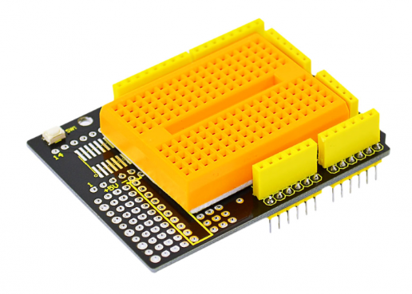
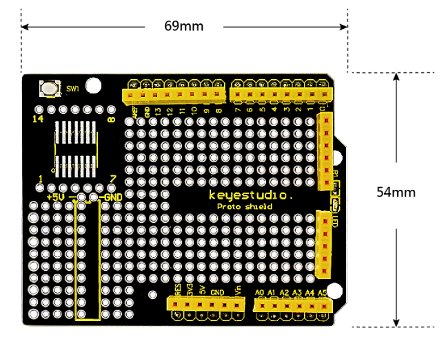
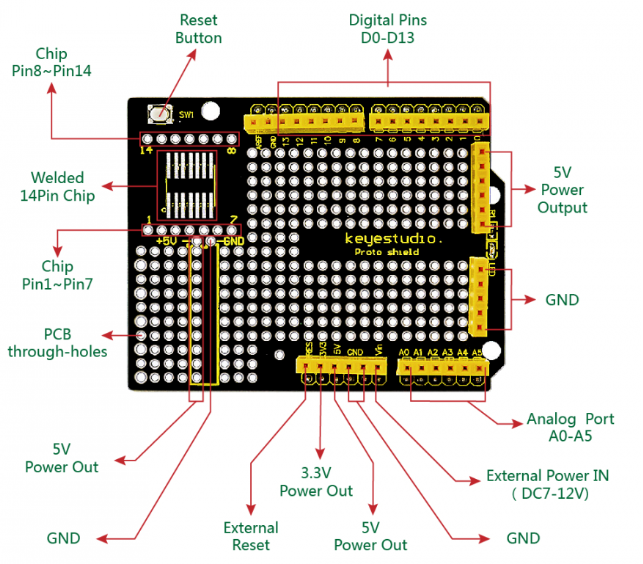
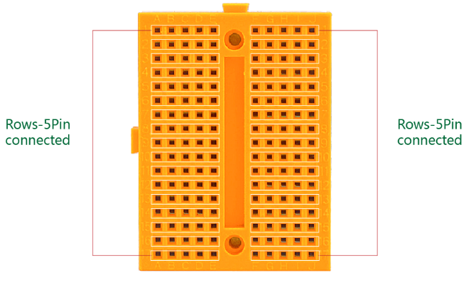
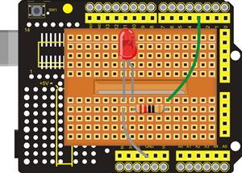

# KS0003 keyestudio Protoshield for Arduino with Mini Breadboard

## 1. Introduction

Keyestudio Proto Shield is particularly designed for the Arduino UNO R3. It makes it easy for you to design custom circuits and solder electronics directly on it. For convenient use, there is a large prototyping space of both connected and unconnected spaced through-holes on the shield.

There is also a soldering position reserved for SMD chip on the protoshield. You can easily solder SMD ICs on the prototyping area to test them with your Arduino board. 

It also extends out a row of power and ground spaced through-holes, giving enough port resources.

You can even stick a mini 170-holes breadboard (included) on the prototyping area. You can weld elements on the shield directly or connect circuits with the mini breadboard.

## 2. Product Parameters

- Can be plugged into the Arduino controller.
- Extend 5V, 3V and Arduino Vin pins.
- Comes with a Reset button.
- Extend out all control pins and power pins of the Arduino.
- Able to build the prototyping circuits matched with Arduino.
- Access to SOIC SMD pin, supporting the soldering of SOIC chips up to 14pin.
- Includes a 170-hole breadboard.

## 3. Controllers Compatible

- keyestudio UNO R3 BOARD /Arduino UNO R3
- keyestudio EASY plug Control Board
- keyestudio Leonardo R3 Development Board
- 51duino

## 4. PCB Dimensions

## 5. Pinout Instructions

## 6. Tiny Breadboard

This is a solderless tiny breadboard. It has 10 columns, and 17 rows - a total of 170 tie in points. This breadboard has a self-adhesive on the back. You can stick it on the prototyping area of protoshield for solderless operation.

## 7. Example Use

You can first stick the 170-tie points breadboard on the prototyping area of Proto Shield. Stack the shield onto UNO R3 board. Use an LED, a resistor and several breadboard jumper wires to build the circuit experiments.

## 8. Package List

- keyestudio Protoshield for Arduino * 1pcs
- 170-hole Breadboard * 1pcs